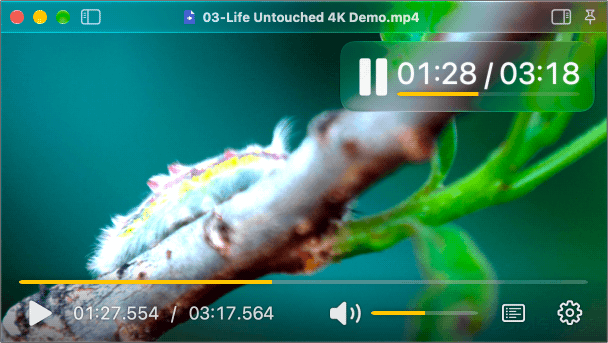

<p align="center">

</p>

<h1 align="center">IINA Advance</h1>

<p align="center">
<b><a href="https://github.com/iina/iina">IINA</a></b> is the modern video player for macOS.<br/>
<b>Advance</b>, as in, <i>advance preview</i> of new or experimental features.<br/>
Or maybe an attempt to <i>advance</i> IINA development more rapidly.
</p>

This project has come a long way from its beginning. But the work continues!

Stable binaries with detailed release notes can be found on the <a href="https://github.com/svobs/iina-advance/releases/">IINA Advance Releases</a> page.

A main goal of IINA Advance is to retain as many of IINA's features and options as possible, while adding new useful features or expanding existing ones. If you find something which looks missing or broken, please [report an issue](https://github.com/svobs/iina-advance/issues).

---

## Enhancements over upstream IINA

*Note: the recent UI overhaul in IINA v1.5 will be merged soon ;)*
<p align="center">

</p>

* Adds ability to keep open windows & other UI state when reopening the app.
* Adds a "custom" window mode which supports sharp corners, and seamless integration with the "custom full screen" mode.
* New OSC color schemes & options such as the ability to change its height, and enhanced OSD with icon.
* An "inside vs. outside" layout paradigm, where the sidebars, "top", & "bottom" panels, can individually be configured to be displayed either as:
  * "Inside": shown as a traditional overlay on top of the video, with options to control how they will be hidden again.
  * "Outside": the panel does not overlap the video. Top and/or bottom panels do not auto-hide when in this mode.
* A much more advanced key bindings system which adds support for multi-key "key sequences" & bindings from Lua scripts, with an enhanced Key Bindings editor featuring color coding & status icons, conflict detection, drag & drop, cut/copy/paste & undo/redo.
* Tons of bug fixes and other enhancements under the hood.

## (Optional) How to copy history & settings from upstream IINA

At present, IINA Advance retains IINA's history database format and shares most of the same settings as IINA, so each should be able to use the other's files without harm. However, because the two apps have different bundle IDs, they store their support files in separate locations and do not share them.

For those who have been using IINA previously and want to copy over its settings, history, and other state, copy each location in the first column below to the location in the second column:

|                       | IINA                                                 | IINA Advance                                      |
|-----------------------|------------------------------------------------------|---------------------------------------------------|
| Primary settings file | `~/Library/Preferences/com.colliderli.iina.plist`    | `~/Library/Preferences/com.iina-advance.plist`    |
| Other support files   | `~/Library/Application Support/com.colliderli.iina`  | `~/Library/Application Support/com.iina-advance`  |

## Building

IINA uses mpv for media playback, which in turn relies on FFmpeg & other dependencies. To build IINA, you must first populate the contents of `deps/lib` with these libraries. You can either fetch copies of these libraries we have already built (using the instructions below) or build them yourself by skipping down to *Option 2: build dependencies manually*.

### Option 1: download the pre-compiled dependencies

1. Download pre-compiled libraries & the latest set of default plugins by running

  ```console
  ./other/download_libs.sh
  ```

  This will repopulate `deps/lib`, `deps/executable`, and `deps/plugins`.  Note that as of v1.6, this now downlaods a completely different set of libs than those from upstream IINA.
2. Open iina.xcodeproj in the [latest public version of Xcode](https://apps.apple.com/app/xcode/id497799835). *IINA may not build if you use any other version.*
3. Build the project.

### Option 2: build dependencies manually

All of the required libs for IINA Advance are built using the [Nix Package Manager](https://en.wikipedia.org/wiki/Nix_(package_manager)). (Unlike the upstream IINA project, HomeBrew is not used at all). For those who want to dive right in, examine the build script `other/nix/build_deps.sh`. For step-by-step instructions, continue reading.

> NOTE: The Nix build **must** be run on a Mac with an Apple Silicon chip.

#### Install Determinate Nix

Nix must first be installed, and the Nix [daemon](https://manual.determinate.systems/command-ref/new-cli/nix3-daemon.html) must be running to build. Although any flavor of Nix should work, [Determinate Nix](https://determinate.systems/nix/) was used for development and is recommended. To install this tool use the [Determinate Nix Installer](https://github.com/DeterminateSystems/nix-installer). Follow the instructions on that page to download and install.

> **Clean Uninstall**: Determinate Nix also provides the ability to easily perform a clean uninstall. To do this on an installed system, run via a terminal: `/nix/nix-installer uninstall`, and enter the admin password if prompted.

#### Install Xcode Command Line Tools

1. Make sure you are using the [latest public version of Xcode](https://itunes.apple.com/us/app/xcode/id497799835). IINA may build with another version but this is not guaranteed.
2. Then make sure the Xcode Command Line Tools are installed. Run in a terminal:

```shell-script
xcode-select --install
```

3. If multiple Xcode versions are installed, select the one you want to use with:

```shell-script
sudo xcode-select -s /Applications/Xcode.app
```

4. Run the first-launch setup to install required system components, check for newer components and install any updates:

```shell-script
xcodebuild -runFirstLaunch -checkForNewerComponents
```

#### Run the Build Script

To run the Nix build, execute the `build_deps.sh` script from IINA’s cloned repository:

```shell-script
./other/nix/build_deps.sh
```

> [!NOTE]
> The first time the Nix build is run it will take a long time. Portions of the build are done in parallel and will use all of the cores available on the Mac. If using a laptop it is desirable to run the build when connected to an electrical outlet.

The script produces [universal binaries](https://developer.apple.com/documentation/apple-silicon/building-a-universal-macos-binary) for the libraries & copies them into `devs/lib`. It also produces headers for FFmpeg & mpv libraries and copies them into `devs/include/…`. These headers are needed because the describe the interfaces used by IINA Advance's code to make direct calls into these project's libraries. Because this is a tight coupling (and because the files are small) the header files are checked into this git repository. Unless `flake.nix` has been modified to build a different version of FFmpeg or mpv the header files should match and `git status` should not show any changes to the header files.

> [!IMPORTANT]
> IINA **MUST** be built with headers that match the version of FFmpeg and mpv being used. If built with the wrong headers, the app may _seem_ to work, but the FFmpeg project is known to change headers in ways that can cause malfunction or crashes. Features that directly use FFmpeg libraries, such as OSC thumbnails, are more likely to exhibit problems.

The Nix build creates a `result` directory under the `other/nix` directory. In the `result` directory you will find the header files as well as an `IINA Advance.app.app`. The Nix build generates an `IINA Advance.app` to confirm IINA Advance can be built with the generated libraries and associated header files. The creation of these files is an intermediate step in the build. The final result of the Nix build is the libraries and header files that have been copied to directories under `deps` for use when building IINA Advance using Xcode.

## Upgrading Dependencies

This section discusses what is involved in changing the Nix build to generate the libraries from newer versions of their associated projects.

1. The Nix build is controlled by the file `other/nix/flake.nix`. Changing the build requires editing this file and then re-running a Nix build with the `--debug` flag so that the build directory is preserved (e.g., `./other/nix/build_deps.sh --debug`. See *Option 2: build dependencies manually*, above). By preserving the build directory, the files in it can be examined to help diagnose build failures.

2. If changing the version of mpv, run `other/parse_doc.rb`. This script will fetch the latest mpv documentation and generate `MPVOption.swift`, `MPVCommand.swift` and `MPVProperty.swift`. Copy them from `other/` to `iina/`, replacing the current files. This is only needed when updating libmpv. Note that if the API changes, the player source code may also need to be changed.

3. Open `iina.xcodeproj` in the [latest public version of Xcode](https://apps.apple.com/app/xcode/id497799835). *IINA may not build if you use any other version.*

4. Add or rename the references to `.dylib` files in the Frameworks group in the sidebar as needed to match the contents of `deps/lib`.

5. Add any `.dylib` files which were added from the previous step into the "Copy Dylibs" phase under "Build Phases" tab of the iina target.

6. Make sure the necessary `.dylib` files are present in the "Link Binary With Libraries" phase under "Build Phases". Xcode should have already added all dylibs under this section, but it sometimes does not.

7. Build the project.

## Contributing

*(Working to expand this section)*

Fixes and improvements to IINA Advance are more than welcome. For now, please feel free to file an issue, feature request, or submit a PR at the [GitHub page](https://github.com/svobs/iina-advance)

## IINA Plugins List
*(copied from upstream IINA)*

### Official Plugins
- **[Online Media](https://github.com/iina/plugin-online-media)** (`iina/plugin-online-media`) - Enhances online streaming and downloading.
- **[OpenSubtitles](https://github.com/iina/plugin-opensub)** (`iina/plugin-opensub`) - Search and download subtitles.
- **[User Scripts](https://github.com/iina/plugin-userscript)** (`iina/plugin-userscript`) - Run custom JavaScript snippets.

### Community Plugins
- **[Anime4K](https://github.com/yorkyang2333/iina-anime4k)** (`yorkyang2333/iina-anime4k`) - Apply Anime4K shaders for real-time anime upscaling.
- **[Bookmarks](https://github.com/wyattowalsh/iina-plugin-bookmarks)** (`wyattowalsh/iina-plugin-bookmarks`) - Save and manage video timestamps.
- **[Clickable Subtitles](https://github.com/kerim/iina-clickable-subtitles)** (`kerim/iina-clickable-subtitles`) - Click subtitles to define words (macOS Look Up).
- **[Danmaku](https://github.com/xjbeta/iina-plugin-danmaku)** (`xjbeta/iina-plugin-danmaku`) - Overlay comments/danmaku on video.
- **[Danmaku Cosmos](https://github.com/karappo-yu/iina-plugin-danmaku-cosmos)** (`karappo-yu/iina-plugin-danmaku-cosmos`) - Niconico/Bilibili danmaku with CSS/Canvas dual rendering, Comment Art support.
- **[Episode Info](https://github.com/Zain-Imam/iina-episode-info)** (`Zain-Imam/iina-episode-info`) - TMDB episode/movie info overlay on pause, with built-in subtitle search.
- **[File Viewer](https://github.com/qktechies/iina-plugin-file-viewer)** (`qktechies/iina-plugin-file-viewer`) - bookmark folders, browse directory contents, and play video files directly within IINA.
- **[Jellyfin](https://github.com/mhajder/iina-jellyfin)** (`mhajder/iina-jellyfin`) - Browse and play media from Jellyfin servers.
- **[Jump to Frame](https://github.com/bbeny123/iina-jump-to-frame)** (`bbeny123/iina-jump-to-frame`) - Navigate video by specific frame number.
- **[Hold to Speed](https://github.com/Tommy12356F/iina-hold-to-speed)** (`Tommy12356F/iina-hold-to-speed`) - Hold Space to play at 2× speed, just like YouTube.
- **[ListenBrainz Scrobbler](https://git.notfire.cc/notfire/iina-listenbrainz)** - Scrobble your music to ListenBrainz.
- **[Multiple Clips](https://github.com/karthisnk/multi-cutter-iina)** (`karthisnk/multi-cutter-iina`) - multiple clip of a video using ffmpeg, with Batch Clipping, Vertical Clip, Format Selection, Preview Clip.
- **[PiP Toggle for IINA](https://github.com/nastarandarjani/iina-pip-toggle)** (`nastarandarjani/iina-pip-toggle`) - Simple plugin to toggle Picture-in-Picture (PiP) to fullscreen.
- **[Playlist Pro](https://github.com/CatCodeDanix/iina-playlist-pro)** (`CatCodeDanix/iina-playlist-pro`) - Seamless management of local and online playlists.
- **[PolyScript](https://github.com/SammoMichael/polyplugin-release)** (`SammoMichael/polyplugin-release`) - Dual subtitles, hover dictionary, and AI-assisted translation for language learning.
- **[recorder](https://github.com/5thDimensionalVader/recorder-iina)** (`5thDimensionalVader/recorder-iina`) - to clip a video using ffmpeg.
- **[Skip Intro](https://github.com/pparanoiidd/iina-skip-intro)** (`pparanoiidd/iina-skip-intro`) - Detect and skip intros, recaps and credits.
- **[Trakt Scrobbler](https://github.com/i3p9/iina-trakt-scrobbler)** (`i3p9/iina-trakt-scrobbler`) - Trakt.tv scrobbler plugin for IINA.


> 💡 **Want to build your own plugin?**
>
> Explore the existing plugins listed here to learn how they work. If you create a new plugin or improve an existing one, feel free to contribute back by adding it to this list via a pull request.

> 🚀 **Interested in creating an IINA plugin?**
>
> Start by exploring the existing plugins here to understand patterns and best practices. Once you’ve built your own plugin, please contribute back by adding it to this README so others can discover and use it.
